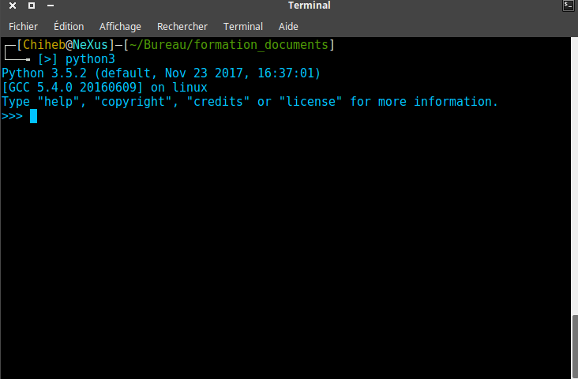

<!-- $theme: default -->

<center>Formation Python/Django</center>
===
Présentée par: **Ladjimi Chiheb Eddine**

---
<center>Questions</center>
===

- Combien de personnes ont utilisé Python ?
( Quels sont les paradigmes que vous avez utilisé au cours de vos expériences de programmation ?
- Langage compilé VS langage interprété ? Et si on peut les fusionner ensemble ?
- Pos & Crons of Python … !?

---

Sommaire:

1. Introduction au langage Python
2. Installation de Python et des modules complémantaires
3. Utilisation de l'interpréteur de Python
4. Les exceptions
5. Les fonctions en Python
6. Programmation Orientée Objet (POO)
7. Programmation fonctionnelle (Functional Programming)
8. Les modules
9. Manipulation des fichiers
10. Programmation avancée en Python
11. Django: The web framework for perfectionists with deadlines.
12.

---
<center>Introduction au langage Python</center>
===
- Crée en 1991 par Guido van Rossum
- Versions actuels supportées par Python Foundation (2.7.x & 3.x). Versions actuelles : 2.7.14 et 3.6.4
- Langage de programmation orienté objet, multi-paradigme et multiplateformes.
- Supporte la programmation impérative, structurée, fonctionnelle et orienté objet
- Licence libre (Free licence)
- Fonctionne sur : Supercalculateurs, ordinateurs centraux,  Unix, Gnu/Linux, Windows, MacOS, Android, IOS, etc.
- Il existe plusieurs implémentations de Python : CPython (C), Jython (Java), IronPython (.net), MicroPython, PyPy et Stackless Python
- Dialects: Cython (C), RPython(R)
- Une claire syntaxe
---

<center>Utilisation</center>
===


- Scripting
- Web
- Automatisation
- Testing
- Développement des prototypes
- calculs scientifique 
- etc.

---
<center>Technique de production des programmes</center>
===

- Compilation: Traduction d'un code source en un langage objet puis assembler les différents objets pour obtenir un objet exécutable sur une macchine déterminée (ou ensemble de machines prédéfinies par la logique derrière le compilateur)
	- Inconvénient: Faut refaire le processus de la compilation à chaque modification du code source
	- Avantage: Rapidité de l'exécution

---
- Interprétation: Chaque ligne source est analysée et exécutée.
	- Avantage: Pas de code objet, pas d'édition de lien 
	- Inconvénient: Plus lent car on doit interpréter à chaque fois
- Technique mixte: On traduit le langage source en un code intermédiaire et on exécute ce code intermédiaire (bytecode).
	- C'est toujours de l'interprété 
	- C'est plus rapide que l'interprétation de source, c'est portable au niveau du bytecode

---

<center>La technique de production de Python</center>
===

Python utilise la technique mixte: Interprétation du bytecode compilé (on le trouve souvent sous les dossiers `__pycache___` et avec une extension `.pyc`.

`code source` -> `compilateur` -> `bytecode` -> `interpréteur` -> `résultat`

---

<center>Installation de Python et des modules complémentaires</center>
===
- On trouve python par défaut dans la majorité des distributions Gnu\Linux, OS X, *BSD et *UNIX et systèmes *UNIX-like (Python2.* ou/et Python3.*)
- Sur Windows, il faut télécharger le binaire de Python via le lien [https://www.python.org](python.org), installer la version voulue (de préférence Python3.* et s'assurer d'ajouter Python au variables d'environnement `PATH` de Windows afin de permettre au Command Prompt (terminal) d'accèder directement à l'interpréteur de Python (CPython).

---




---

Pour installer des modules complémentaires à Python:
- Utiliser le Package Installer `pip` de Python
- Installer les modules via `setup.py` qui et un standard de fichier d'installation des modules en Python via la commande `python3 setup.py install`
- Utilisation de `py2xe` ou `cx_freeze` ou `py_installer` sur Windows pour générer des fichier exécutables .

---
<center>Utilisation de l'interpréteur de Python</center>
===

- Les commentaires:

```python
# Ceci est un commentaire
#######################################
#--- Ceci est un autre commentaire ---
#######################################
3 * 5 # Ceci est un autre commentaire
```
---

- Les expressions booléennes: `True` et `False`, `0` et `!= 0`

```python
2 > 5 # False
3 <= 4 < 6 # True
```
- Opérateurs logiques: `and`, `or` et `not` == `&`, `|` et `!=`

```python
(3 >= 3) or (10 > 10)  # True dès le premier test
(10 > 10) and (1 == 1) # False
10 > 10 and 1 == 1     # False
1 and 2                # 2 => & binaire
0 and 2                # 0 => and binaire
0 or 1                 # 1 => | binaire
'1' and 1              # 1 => 1 binaire
'' and 1               # '' => binaire
'1' or ''              # '1' => binaire
```
---

- Opérations arithmétiques

```python
10 + 3   # 13
10 - 3   # 7
2 * 5    # 10
2 ** 3   # 8
20 / 3   # 6.666666666666667
20 / 3   # 2 => reste de la division
20 // 3  # 6 => quotient de la division (modulo)
20.0 / 5 # 4.0 => résultat est un flottant
```

- Opération sur les bases

```python
0b1 + 0b1   # 2 => addition binaire
0o7 + 0o1   # 8 => addition octale
0x5 + 0xff2 # 4087 => addition hexadécimale
int('1110', 3) # 39 => conversion du string '1110' en base 3
hex(5+3)       # 0x8 => conversion en hexadécimal

```

---

- Opérations mathématiques usuelles

```python
import math
math.cos(20)   # 0.40808206181339196
```

- Type complex

```python
(5 + 3j) + (6 - 8j) # 11 - 5j
```

---
- Les variables: Par convention les noms des variables sont érites en minuscule, elles commencent par une lettre ou un caractère souligné `_` et elles doivent évidemment être différents des mots réservés de Python.

Les mots réservés en Python:

```python
False      class      finally    is         return
None       continue   for        lambda     try
True       def        from       nonlocal   while
and        del        global     not        with
as         elif       if         or         yield
assert     else       import     pass
break      except     in         raise
```

---

<center>Les exceptions</center>
==

```python
>>> 1 + 'a'
Traceback (most recent call last):
  File "<stdin>", line 1, in <module>
TypeError: unsupported operand type(s) for +: 'int' and 'str'
```
```python
>>> 1/0
Traceback (most recent call last):
  File "<stdin>", line 1, in <module>
ZeroDivisionError: division by zero
```
```python
>>> a
Traceback (most recent call last):
  File "<stdin>", line 1, in <module>
NameError: name 'a' is not defined
```
---

```python
>>> raise ValueError()
Traceback (most recent call last):
  File "<stdin>", line 1, in <module>
ValueError
```
```
>>> try:
...     1 + 'a'
... except TypeError as e:
...     print(e)
... 
unsupported operand type(s) for +: 'int' and 'str'
```
```python
>>> try:
...     raise Exception('mon exception')
... except Exception as e:
...     print(e)
... 
mon exception

```
---

<center>Les fonctions (méthods) en Python</center>
===

Avant de visualiser les fonctions (méthodes) en Python, on va brièvement noter les types de variables:

```python
>>> type('hello')
<class 'str'>		# string
>>> type(3)
<class 'int'>		# integer
>>> type(3.1)
<class 'float'>		# float
>>> type([])		
<class 'list'>		# list / array (mutable)
>>> type({})		
<class 'dict'>		# dict / dictionary
>>> type(())
<class 'tuple'>		# tuple => (liste immutable)
>>> type(list())        # constructeur de listes
<class 'list'>		
>>> type(dict())        # constructeur de dictionnaire
<class 'dict'>
>>> type(tuple())
<class 'tuple'>          # constructeur de tuple
```
---

Les boucles en Python
```python
# for elm in iterable
>>> for elm in range(10):
...     if elm % 2 == 0:
...         print(elm)
... 
0
2
4
6
8

# while condition:
>>> while j < 10:
...     if j % 2 == 0:
...         print(j)
...     j += 1
... 
0
2
4
6
8
```

---
```python
>>> class Hello:	# classe vide
...     pass	
... 
>>> a = Hello()
>>> type(a)
<class '__main__.Hello'>
>>> class MyInt(int):
...     pass
... 
>>> a = MyInt()
>>> type(a)
<class '__main__.MyInt'>
```

---

```python
>>> class Test:
...     pass
... 
>>> a = Test()
>>> a			# Nom de l'objet a
<__main__.Test object at 0x7f72328ae208>
# Changement du string de représentation de l'objet
>>> class Test:
       # magic class de représentation
...     def __repr__(self):
...         return 'hello from test!'
... 
>>> a = Test()
>>> a 
hello from test!
```

---

Les fonctions (méthodes) en Python
```python
>>> def test():
...     print('hello from test')
... 
>>> test()
hello from test
>>> a = test()
hello from test  # affichage vue que print() existe
>>> a            # a == None
>>> a = test     # a est maintenant la fonction test
>>> a()          # a est maintenant callable
hello from test
```

```python
>>> def test():
...     return 'hello from test'
... 
>>> a = test()
>>> a
'hello from test'
>>> print(a)
hello from test
```

---

Les fonctions (méthodes) avec des arguments:

```python
>>> def test(a=''):
...     return a
... 
>>> a = test('hello')
>>> print(a)
hello
>>> def test(a):
...     return a
... 
>>> a = test('hi') # Pas de check sur
>>> print(a)	   # la nature de l'argument
hi

```
---

Passage des arguments:
```python
>>> def test(a, *args, **kwargs):
...     print(a, args, kwargs)
... 
>>> a = test('hello', 'hi', 'hoo')
hello ('hi', 'hoo') {}
```
```python
# a = {'a', 'hello', 'b': 'hi', 'c', 2}
# args=(), kwargs = {}
>>> test({'a': 'hello', 'b': 'hi', 'c': 2})
{'c': 2, 'a': 'hello','b': 'hi'} () {}
# a = 'hello'
# args = ()
# kwargs = {'b':2, 'c': 3} 
>>> test(a='hello', b=2, c=3)
hello () {'c': 3, 'b': 2}
# a = 'hello'
# args= [1, 2, 3]
# kwargs = {'b': 3}
>>> test('hello', [1,2,3], b=3)
hello ([1, 2, 3],) {'b': 3}
```
---
Python n'est pas un langage typé, mais on peut utiliser ce type d'écriture pour vérifier la nature des arguments et la nature du retour des fonctions (méthodes). Mais, l'interpréteur du Python ne va pas balancer une erreur si on modifie la nature des arguments.
```python
# type d'écriture valide pour Python3.5+
>>> def test(a:str, b:int) -> int:
...     return b
... 
>>> test('hello', 1)
1
>>> test('hello', 'hi')
'hi'
```

---

Lambda un autre type de fonctions (méthodes) ? ... Les fonctions anonymes

```python
>>> test = lambda x: x
>>> a = test('hello')
>>> a
'hello'
>>> print(a)
hello
```
```python
>>> test = lambda x, y: (x, len(y))
>>> a = test('hello', 'hello')
>>> print(a)
('hello', 5)
>>> print(a[0], a[1])
hello 5
```
---
<center>Programmation Orientée Objet (POO)</center>
===
Création d'une classe (un objet)
```python
>>> class Hello:
...     pass
... 
>>> Hello
<class '__main__.Hello'>
>>> a = Hello
>>> a
<class '__main__.Hello'>
```
En réalité, lors qu'on crée une classe (un objet), on passe par un exemple de définition des `magic methods` qui auront cette forme: `__ma_fonction_magique__`

---

La majorité connaisse la fonction magique `__init____`, et la majorité croit que c'est la fonction qui sera appelé lors de la création d'un objet (constructeur d'une classe ou d'un objet). Mais, en vérité l'ordre de l'appel des `magic methods` est :

---

- `__new__(cls, [...)`: Première méhode appelé lors de l'instanciation d'un objet
- `__init__(self, [...)`: Constructeur de la classe
-  `__del__(self)`: Destructeur de la classe (`x.__del__()` doit contenir seulement les règles lors de la destruction de l'objet. Sinon, Python est implémenté avec le `Garbage Collector` comme un Management Automatique Memory
- Plusieurs autres `magic methods`

---
Liste non exaustive des `magic methods`:

- `__cmp__(self, [...)`: L'implémentation des opérateurs de compararaison `<, >, !, !=, ==, etc.`
- `__eq__(self, [..)`: L'implémentation de l'opérateur `==`
- `__ne__(self, [..)`: L'implémentation de l'opérateur `!=`
- `__lt__(self, [..)`: L'implémentation de l'opérateur `<`
- `__gt__(self, [..)`: L'implémentation de l'opérateur `>`
- `__lte__(self, [..)`: L'implémentation de l'opérateur `<=`
- `__gte__(self, [..)`: L'implémentation de l'opérateur `>=`
- Et plusieurs autres méthodes ...

---


Exemple de cas de l'utilisation des `magic methods`:

```python
>>> class Test(int):
...     def __new__(cls, num):
...         return int.__new__(cls, num)
...     def __le__(self, num2):
...         return self > num2
... 
>>> a = Test(2)
>>> b = Test(3)
>>> a > b
False
>>> type(a)
<class '__main__.Test'>
>>> type(b)
<class '__main__.Test'>
>>> a
2
>>> b
3
```
---

`Hello world!` en Python (POO)
```python
>>> class Hello:
...     def __init__(self, val=''):
...         self.val = val
...     def get(self):
...         return self.val
...     def set(self, val):
...         self.val = val
... 
>>> a = Hello()
>>> a.set('Hello world!')
>>> a.get()
'Hello world!'
```

---
<center>Programmation fonctionnelle (Functional Programming)<center>
===

Prenons l'exemple d'une somme d'une liste des entiers, une des approches traditionnelles sera comme suit:

```python
>>> def somme(a=[]):
...     final=0
...     for elm in a:
...         final += elm
...     return final
...
>>> my_numbers = [1, 2, 3, 4, 5]
>>> final_somme = somme(my_numbers)
>>> print(final_somme)
15
```
Dans cette approche on constate que la variable `final` change durant chaque itération. Ceci dit, `final` est un variable **mutable**.

---

En programmation fonctionelle (type `déclaratif` != type `impératif`):
- Ne pas changer l'état et la mutation des variables 
- Mettre en avant l'appliation des fonctions

```python
# récusion
>>> def somme(a):
...     if not a :
...         return 0
	# retour des valeurs 
        # sans changer le statut des variables
...     return a[0] + somme(a[1:])
... 
>>> somme([1, 2, 3, 4])
10
```
---

On peut aussi utiliser les fonctions `built-in` de Python
```python
>>> sum([1, 2, 3, 4])
10
```
```python
>>> from functools import reduce
# Somme de: ((((1 + 2) + 3) + 4) + 5)
>>> reduce(lambda x, y: x + y, [1, 2, 3, 4])
10
```
---

Autre exemples: 
```python
# map: retourne un iterable
# sum: fait la somme d'un iterable
>>> print(sum(map(lambda x: x + 1, [1, 2, 3, 4])))
14
# Avec une list comprehension
# Ceci n'est pas une programmation fonctionnelle
>>> print(sum(k + 1 for k in [1, 2, 3, 4]))
```
---
<center>Les modules</center>
===
Des exemples des modules `built-in` avec Python

```python
>>> from datetime import datetime
>>> date = datetime.now().strftime('%d/%m/%Y %H:%M:%S')
>>> print(date)
'27/03/2018 13:50:57'
```
```python
>>> lst = "hello"
>>> for k, v in enumerate(lst):
...     print(k, v)
... 
0 h
1 e
2 l
3 l
4 o
```
---
```python
# 1er élement dans a et le 1er dans b
...
# nième élement in a et le nième dans b
# s'arrête avec l'itérable le moins long
>>> for k, v in zip(a, b):
...     print(k, v)
... 
0 h
1 e
2 l
3 l
4 o
```
---
```python
# comme zip mais continue avec l'itérable
# le plus long
>>> from itertools import zip_longest
>>> for k, v in zip_longest(range(6), 'hello'):
...     print(k, v)
... 
0 h
1 e
2 l
3 l
4 o
5 None
```
```python
>>> from itertools import goupby
# Grouper selon une fonction (lambda ou autre)
>>> for k, v in groupby('hello', lambda x: x):
...     print(k, list(v))
... 
h ['h']
e ['e']
l ['l', 'l']
o ['o']
```
---

```python
# list comprehension
>>> [k%2 for k in range(10)]
[0, 1, 0, 1, 0, 1, 0, 1, 0, 1]
# 0 est évalué comme False
# et les autres chiffres comme True
>>> list(filter(lambda x: x%2, range(10)))
[1, 3, 5, 7, 9]
# le retour de lambda est True ou False
>>> list(filter(lambda x: x%2==0, range(10)))
[0, 2, 4, 6, 8]
```
---

Fichier 1: `fichier1.py`
```python
def say_string(val):
    print(val)
```
Fichier 2: `say_hello.py`
```python
from fichier1 import say_string

say_string('hello world!')
```
Structure:
```bash
.
├── fichier1.py
└── say_hello.py

```
sur la terminale:
```bash
$ python3 fichier2.py
'hello world!'
```


<!--
page_number: true

Introduction au langage de programmation Python
-->